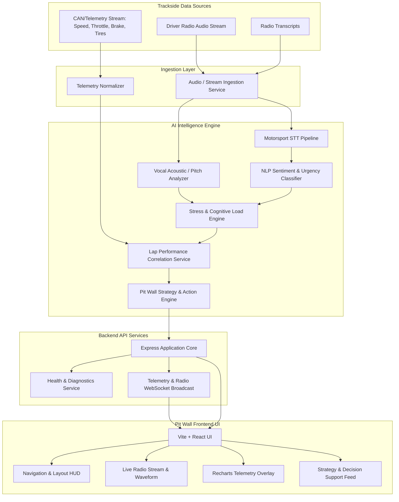

# ApexRadio AI - System Architecture

## 1. High-Level Architecture Overview

ApexRadio AI processes multi-modal race communications and vehicle telemetry to provide pit wall race engineers with real-time driver state awareness and strategy decision support.

---

## 2. Core Subsystems

### 2.1 Audio & Radio Pipeline
- Ingests raw audio feeds from driver-to-pit radio channels.
- Cleans wind, road, and high-RPM engine noise.
- Transcribes transmissions into textual tokens with motorsport-tuned vocabulary.

### 2.2 Stress & Cognitive Load Engine
- Evaluates acoustic metrics (jitter, shimmer, speech rate, vocal cadence).
- Analyzes linguistic sentiment, urgency markers, and expletives/stress vocabulary.
- Computes a normalized **Driver Stress Index (0-100)** with confidence intervals.

### 2.3 Telemetry Correlation Service
- Aligns stress timestamps with time-series vehicle telemetry:
  - Corner entry/exit speeds
  - Braking points and lock-up instances
  - Throttle smoothness and tire degradation rate
- Flags anomalies such as stress spikes preceding driving errors or pace drops.

### 2.4 Pit Wall Decision Support
- Evaluates pit strategy impact (undercut timing, tire life projection).
- Issues "Radio Silence" recommendations during critical high-stress maneuvers.
- Suggests clear, concise engineer responses tailored to the driver's current cognitive load.

### 2.5 Presentation Layer (Frontend)
- High-contrast, dark monochrome telemetry UI designed for low-light, high-speed pit wall environments.
- Minimalist component system prioritizing immediate data readability and low cognitive friction.
